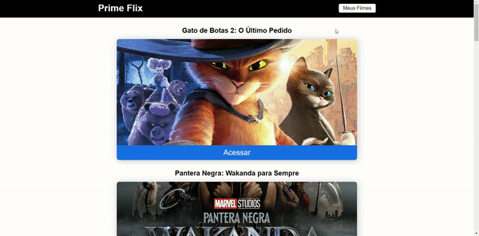
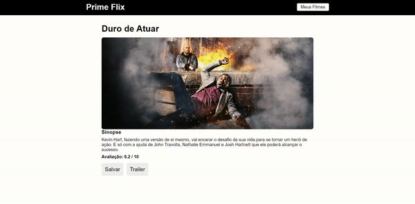
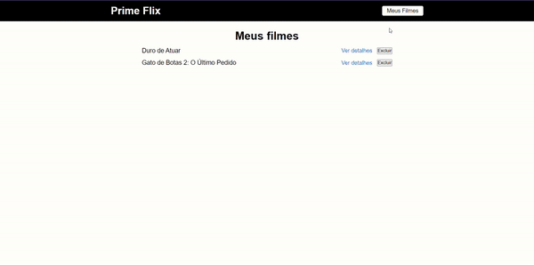

<h1 align="center">
  PRIME FLIX
</h1>
<h3>
 Movie Catalog - Project to practice learning the React JS Course - Matheus Fraga Udemy Course https://bityli.com/jmZ66g
</h3>

## Table of contents:

- [About the project](#about-the-project)
- [Technologies](#technologies)
- [Prerequisites](#prerequisites)
- [Getting started](#getting-started)
- [File structure](#file-structure)
- [License](#license)
- [Contact](#contact)

## About the project:

<div>
    
  
  
  
  
  
  
  
</div>

Project developed with React JS, with the purpose of simulating a movie catalog website.


Objective:

- It's supposed to show a list of the last ten movies added in the api.
- It's supposed to show movie details.
- Add and remove movies from favorites page:
  - Directly from the movie details page
  - On the favorites page itself.

## Technologies

:white_check_mark: React JS\
:white_check_mark: Styled-components\
:white_check_mark: React-toastify\
:white_check_mark: React-router-dom\
:white_check_mark: Axios\
:white_check_mark: React Hooks

## Prerequisites

Before proceeding, it is ideal that you have the environment set up to create applications in React Native, for this you can follow the guide of the link below:

[React JS's Environment (web)](https://react.dev/learn/start-a-new-react-project)

## Getting started

```bash
First you clone the project:

$ git clone https://github.com/AlineLima713/PrimeFlix.git && cd PrimeFlix

Then you run the following command to install packages:

$ yarn install

Next, you start the project:

$ yarn start
```

## File structure

A estrutura de arquivos está da seguinte maneira:

```bash
├── src/
│   ├── Components/
│   │   └── Header/
│   │       └── header.css
│   │       └── index.js
│   ├── pages/
│   │   └── Error/
│   │       └── error.css
│   │       └── index.js
│   │   └── Favoritos/
│   │       └── favoritos.css
│   │       └── index.js
│   │   └── Filme/
│   │       └── filme-info.css
│   │       └── index.js
│   │   └── Home/
│   │       └── home.css
│   │       └── index.js
│   ├── services/
│   │   └── api.js
│   ├── App.js
│   └── index.css
│   ├── index.js
│   └── routes.js
├── .gitignore
├── LICENSE
├── package-lock.json
├── package.json
└── README.md
```

## License:

This project is licensed under the MIT License - see the [LICENSE](https://github.com/AlineLima713/PrimeFlix/blob/main/LICENSE) file for details.


## Contact:

alinelima713@gmail.com | [WhatsApp](https://wa.me/qr/DC44WEYUAZTVD1 'My whatsapp')  |  [Instagram](https://www.instagram.com/alinelima_prog/ 'My instagram')  |  [Linkedin](https://www.linkedin.com/in/aline-lima-977986b0/ 'My linkedin')

<div align="center">
  Made with :heart: by <strong>Aline Lima</strong> 😊
</div>

